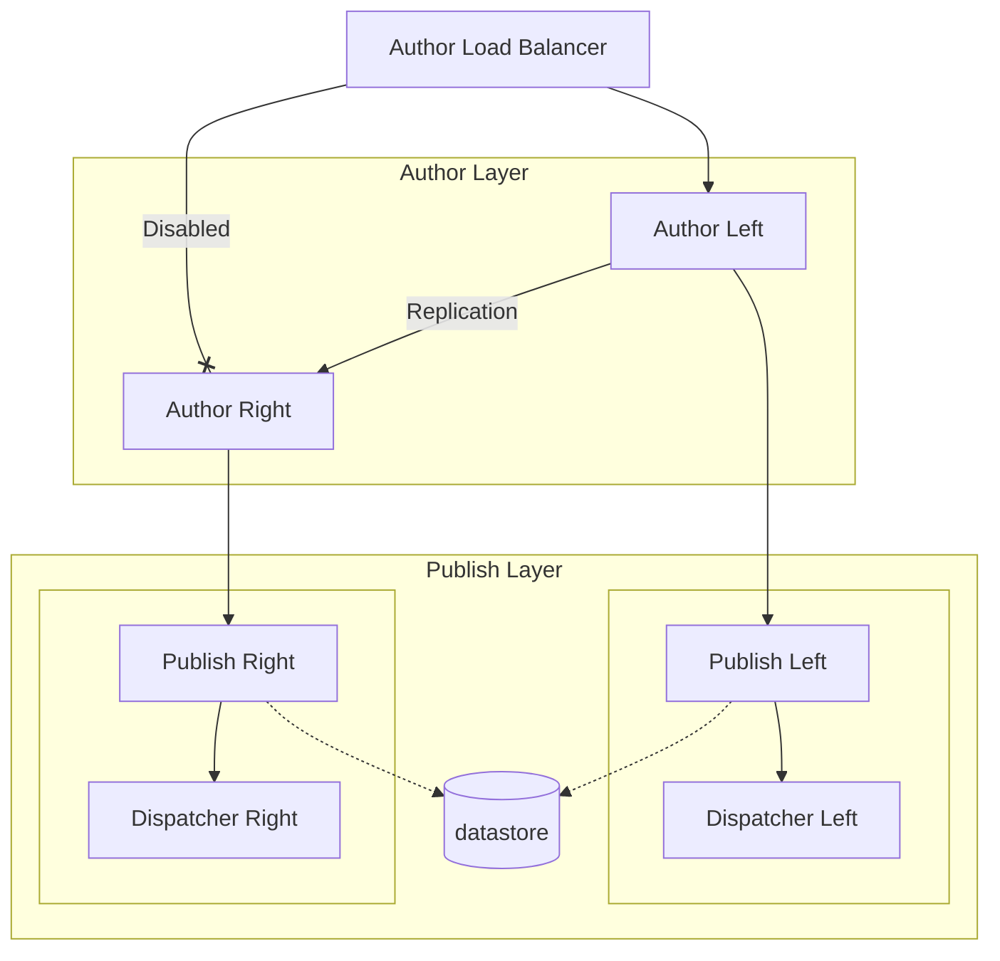
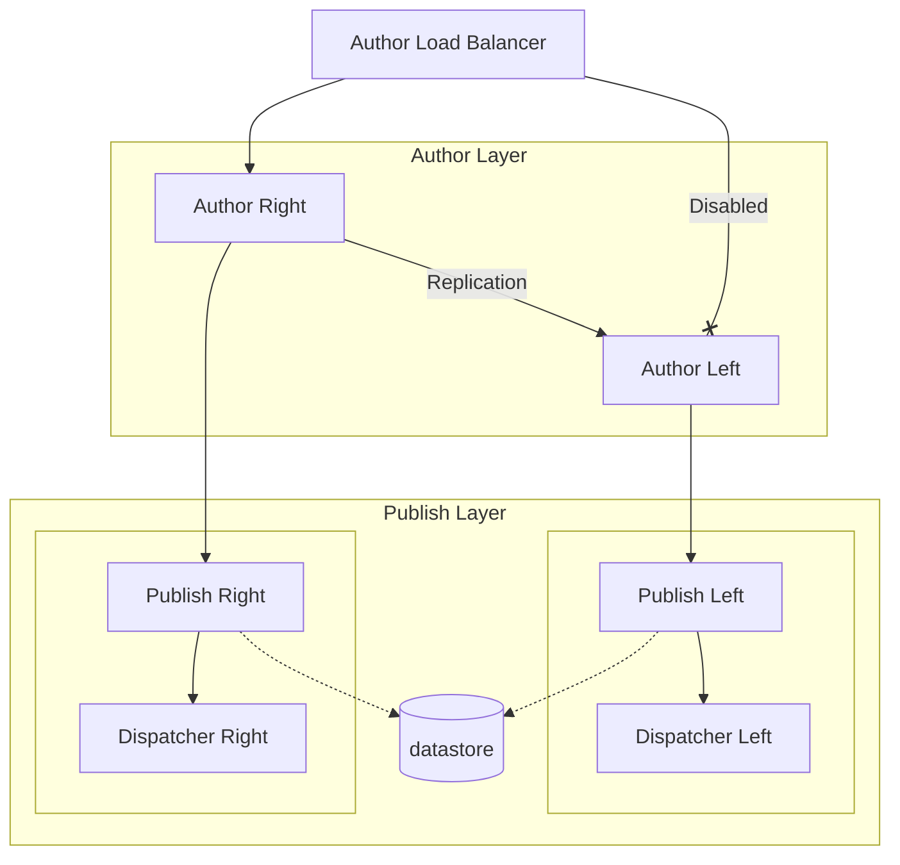

# Devops Author Replication

Using replication agents to keep Primary and Secondary Author synced.

## Left Side Active

- Allow authoring on Left Author
- Replicate all updates to Right Author with binaryless flag 




## Right Side Active

- Allow authoring on Right Author
- Replicate all updates to Left Author with binaryless flag



 
## Start up Setup

To be able to replicate freely between authors we need to make sure they use same encryption key. 
Lets ensure any secrets on both authors are encrypted with the same key.

1. Start traefik, this will be accessible on http://traefik.localhost:8080/

```powershell
docker compose up traefik
```

2. Install private HTTPS CA root chain in `services/traefik/certs/mkcert.pfx`.

3. Start Left author

```powershell
docker compose up author-left
```

4. Find the encryption key and copy it to shared volume

You need to use bash for this commands.

```bash
JAR_NAME="com.adobe.granite.crypto.file"; CONTAINER_NAME="devops-author-replication-author-left-1"; DATA_PATH=$(docker exec ${CONTAINER_NAME} find '/aem/crx-quickstart/launchpad/felix' -name 'bundle.info' -execdir bash -c 'grep -rnqw -e '$JAR_NAME' "$1" && find . -name data -exec realpath \{\} \;' _ {} +;); docker exec ${CONTAINER_NAME} cp -p ${DATA_PATH}/hmac /aem/key/; docker exec ${CONTAINER_NAME} cp -p ${DATA_PATH}/master /aem/key/
```

5. Start Right author

```powershell
docker compose up author-right
```

As soon as you have started AEM do the next step 6

6. Copy encryption key from shared volume to bundle location

You need to use bash for this commands.

```bash
JAR_NAME="com.adobe.granite.crypto.file"; CONTAINER_NAME="devops-author-replication-author-right-1"; DATA_PATH=$(docker exec ${CONTAINER_NAME} find '/aem/crx-quickstart/launchpad/felix' -name 'bundle.info' -execdir bash -c 'grep -rnqw -e '$JAR_NAME' "$1" && find . -name data -exec realpath \{\} \;' _ {} +;); docker exec ${CONTAINER_NAME} cp -p /aem/key/hmac ${DATA_PATH}/; docker exec ${CONTAINER_NAME} cp -p /aem/key/master ${DATA_PATH}/; docker compose restart author-right 
```

7. Wait for authors to start and input your license key

    - Author Left https://author-left.localhost
    - Author Right https://author-right.localhost

8. To enable WebDav on authors 

```powershell
docker compose up author-left-webdav
docker compose up author-right-webdav
```

9. Checkout pre-installed Replication agents

    Replication agents are activated by run-modes, each author has its own run-mode, this ensures you can have separate replication agents that will not activate when replicated.

     - Agents on Author Left (runmode: authorleft) http://author-left.localhost/miscadmin#/etc/replication/agents.authorleft
       - this agent will only be activate on Author that has a run mode "authorleft" even if its marked as Enabled.
     - Agents on Author Right (runmode: authorright) http://author-left.localhost/miscadmin#/etc/replication/agents.authorright
       - this agent will only be activate on Author that has a run mode "authorright" even if its marked as Enabled.